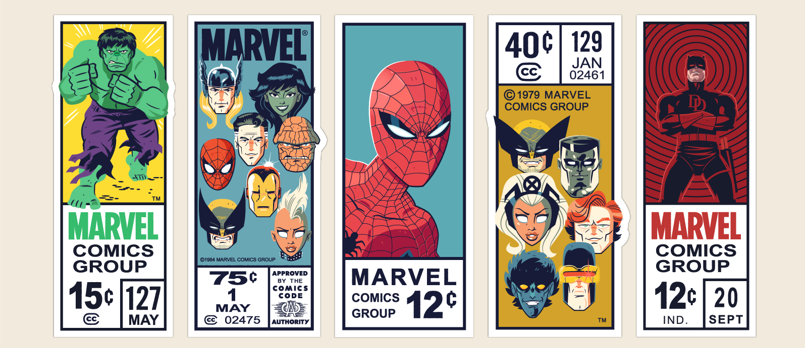

# marvel-comics
<h1 align="center">
    
</h1>

<h4 align="center">
  Marvel Comics
</h4>

  <a href="#-tecnologias">Tecnologias</a>&nbsp;&nbsp;&nbsp;|&nbsp;&nbsp;&nbsp;
  <a href="#-projeto">Projeto</a>&nbsp;&nbsp;&nbsp;|&nbsp;&nbsp;&nbsp;
  <a href="#-layout">Layout</a>&nbsp;&nbsp;&nbsp;|&nbsp;&nbsp;&nbsp;
  <a href="#-layout">Configuração</a>

 

  

## :tecnologias: Tecnologias

Esse projeto foi desenvolvido com as seguintes tecnologias:

- [React](https://reactjs.org)
- [Vite](https://vitejs.dev/guide/#scaffolding-your-first-vite-project)
- [Styled-Components](https://styled-components.com/)
- [React-Modal](https://reactcommunity.org/react-modal/)

## 💻 Projeto

O Marvel Comics é um projeto que busca os quadrinhos da api da marvel, mostra em tela ,e possui as seguintes funcionalidades:
- filtro de pesquisa dos quadrinhos pelo nome
- modal com informações detalhadas de cada quadrinho
- funcionalidade de selecionar cada quadrinho
- mostrar modal dos quadrinhos selecionados

## 🔖 Layout

Você pode visualizar o layout do projeto no formato através [desse link](https://www.figma.com/file/2C2yvw7jsCOGmaNUDftX9n/Be-The-Hero---OmniStack-11?node-id=37%3A394). Lembrando que você irá precisar ter uma conta no [Figma](http://figma.com/).

## ⚙ Configuração

1- Antes de começar, você vai precisar instalar na sua máquina as seguintes ferramentas: Git, Node. Além disso, é bom ter um editor para trabalhar com código, como o <a href="https://code.visualstudio.com/download">VSCode</a>.

Para instalar as dependências no front-end:
> npm install
Para iniciar a aplicação no front-end e no back-end:
> npm run dev
